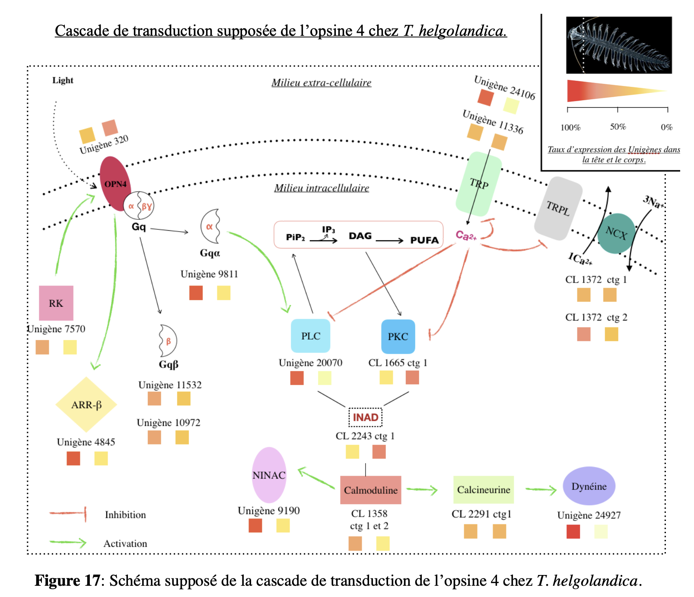
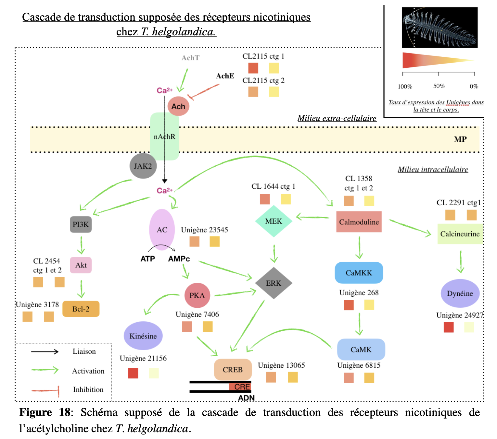
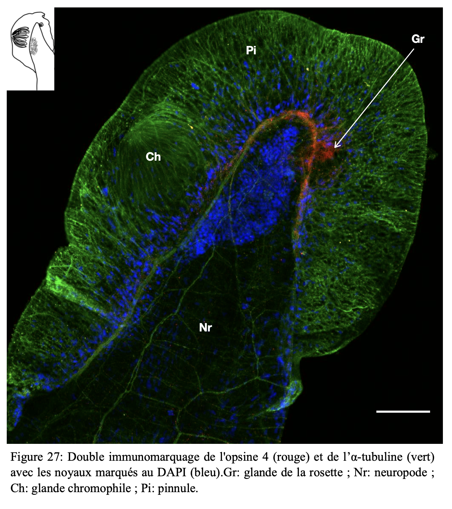

```{=html}
<style>
body {
  font-family: "Times New Roman", serif;
   font-size: 17px;
}
</style>
```

```{=html}
<style>
p {
  text-align: justify;
}
</style>
```

------------------------------------------------------------------------

<h2 style="color: black; font-weight: bold; text-align: center;">
Investigating the molecular mechanisms involved in the control and perception of bioluminescence in *Tomopteris helgolandica*
</h2>

------------------------------------------------------------------------

**Summary**

<div style="color: black;">
Bioluminescence is a widespread phenomenon in marine organisms, yet its molecular regulation remains poorly understood in many species. This study investigates the potential mechanisms involved in the **control and perception of light emission** in the polychaete *Tomopteris helgolandica*.

Previous transcriptomic analyses suggested the presence of **opsin 4**, an extraocular photoreceptor potentially involved in light perception. This work aimed to determine whether the molecular components involved in both light emission control and photoreception are present in this species. The study focused on two key elements: the **nicotinic acetylcholine receptors** potentially involved in the control of bioluminescence, and **opsin 4**, which may enable the organism to detect light signals.

Through transcriptomic and immunological approaches, this work explored the **presence and localization** of these proteins within the organism, providing insights into the potential coupling between light production and light perception in luminous marine organisms.
<div>

------------------------------------------------------------------------

**Keywords**

Bioluminescence • *Tomopteris helgolandica* • opsin 4 • acetylcholine receptors • photoreception • marine polychaetes

------------------------------------------------------------------------

### Methods

-   **Specimen collection** and fixation of *Tomopteris helgolandica*
-   **Transcriptomic analyses** to identify genes involved in light emission and photoreception
-   **In silico sequence analyses** to detect opsin 4 and nicotinic acetylcholine receptor sequences
-   **Phylogenetic analysis** of identified sequences
-   **Protein detection using Western blot**
-   **Immunohistological analyses** to determine the localization of opsin 4 and acetylcholine receptors
-   **Fluorescence microscopy** to visualize protein expression in tissues

------------------------------------------------------------------------

### Key Results

::: {style="text-align: left;"}
-   Transcriptomic analyses revealed the presence of proteins involved in the **signal transduction pathways of nicotinic acetylcholine receptors and opsin 4**.
:::

::: {layout-ncol="2"}
{width="100%"}

{width="98%"}
:::

::: {style="text-align: left;"}
-   Immunological analyses confirmed the **presence and localization of these proteins in the rosette glands located in the parapodia** of *T. helgolandica*. 

{width="60%" style="display:block; margin:0 auto;"}
:::

-   These findings suggest that the species possesses the **molecular components required both to control and to perceive its own bioluminescence**.

-   The results provide **the first evidence of a potential coupling between light emission and light perception in a polychaete species**.

-   This mechanism may indicate a **functional convergence in luminous organisms**, where photoreception directly regulates light production at the emission site.

------------------------------------------------------------------------

<iframe src="Files/Master_thesis/Master_thesis_bioluminescence.pdf" 
        width="80%" height="800px"
        style="display:block; margin:0 auto;">
</iframe>
<br>


<iframe src="files/Master_thesis/Biol.pdf" 
        width="90%" height="550px" 
        style="display:block; margin:0 auto;">
</iframe>
<br>

[Anne_Vanhove_Master's_thesis.pdf](Files/Master_thesis/Master_thesis_bioluminescence.pdf) and [Presentation.pdf](Files/Master_thesis/Biol.pdf)


------------------------------------------------------------------------
